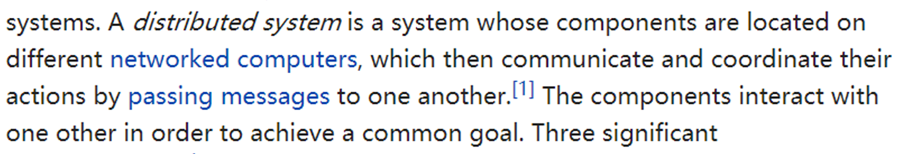

# Distributed System vs. Network

### What's a distributed system? 

### Similarities and differences between a distributed system and a network

What's worth discussing and distinguishing is the similarities and differences between a distributed system and a network. 

Although their physical structures are nearly the same, it is worth noting that a distributed system and a networked system appear differently to the client. A client for network knows about network resources; a client for distributed system, on the other hand, the scheduling process is completely transparent to the client. 

Therefore, a distributed system seems to have more responsibility dealing with issues than a networked system. 

